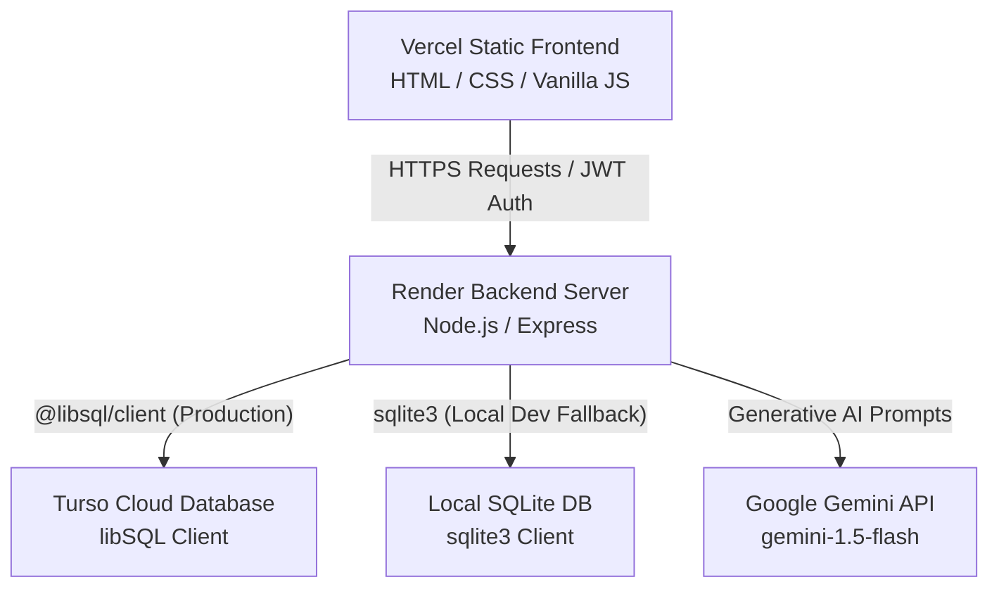
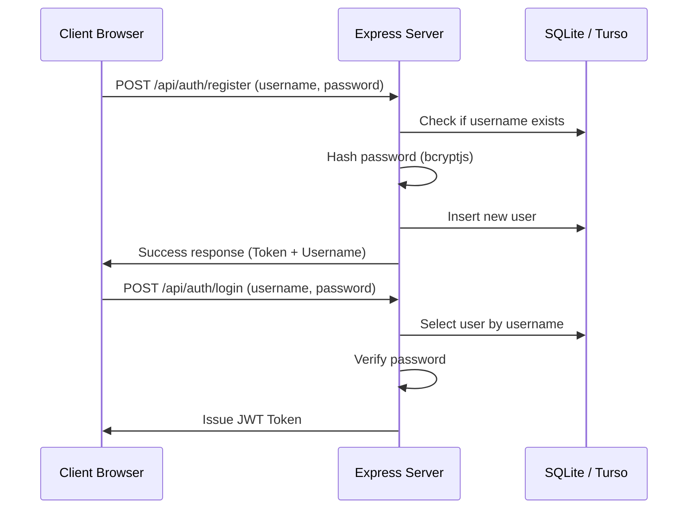

# 🌀 Life Ruination Protocol

A satirical full-stack web application that humorously guides users through a "systematic approach to dismantling their existence" over 56 carefully crafted, awkward days. Built with a decoupled architecture, the project features a premium warm-cream user interface, secure SQLite/Turso database synchronization, JWT authentication, and an AI-powered custom ruination advisor powered by Google Gemini.

> [!WARNING]
> **Satirical Content Disclaimer**: This is a dark comedy art project created for entertainment purposes only. The content is strictly satirical and is not meant to be taken seriously or acted upon in real life.

---

## 🏗️ Architecture

The application is built using a modern, decoupled full-stack architecture designed for seamless deployment:



### 1. Frontend (Deployed on Vercel)
* **Stack**: Pure Vanilla HTML5, CSS3, and JavaScript (ES6+).
* **Styling**: Sleek cream-and-white custom theme with royal blue interactive elements, dynamic shadows, and a retro warm-dark brown developer terminal.
* **Routing**: Static assets served cleanly by Vercel via custom routing rules in `vercel.json`.

### 2. Backend (Deployed on Render)
* **Stack**: Node.js & Express.js.
* **Security**: JWT-based token authentication for progress synchronization, password hashing using `bcryptjs`, and complete separation of private server configs from client assets.
* **CORS Integration**: Configured to support cross-origin API calls specifically from the Vercel frontend domain.

### 3. Database Layer (Online Turso or Local SQLite)
* **Dual-Driver Client (`db.js`)**: Automatically routes queries depending on the environment:
  * **Production**: Connects to the **Turso cloud database** (via `@libsql/client` HTTP protocol) to keep user data secure and persistent across Render restarts.
  * **Local Dev Fallback**: Gracefully falls back to a local SQLite database (`database.db`) using the `sqlite3` driver if no cloud environment credentials are set.

### 4. Generative AI Engine (Google Gemini)
* **Endpoint**: `/api/generate-plan`
* **Model**: `gemini-1.5-flash` with structured JSON output formatting.
* **Fallback Handler**: If the API key is not active or has expired, a local keyword-matching algorithm kicks in to output a humorously tailored ruination task list, keeping the application fully functional and testable offline.

---

## 🔄 Application Workflow

### 1. User Authentication & Authorization


### 2. Progress Synchronization Loop
* When checking off a task, changing the navigation day, or unlocking an achievement:
  1. The client updates its local state variables.
  2. A POST request is dispatched to `/api/progress` containing all metrics (`social`, `financial`, `professional`, `health`), `completedTasks` arrays, and achievements.
  3. The backend saves the serialized progress state to the database matching the user's JWT ID.
* Upon logging in, the frontend sends a GET request to `/api/progress` to load the exact state from the server.

### 3. Custom AI Plan Generation
* Users input a brief description of their lifestyle (e.g. *"Software engineer who drinks too much espresso and plays MMOs"*).
* The backend constructs a satirical prompt, requesting Gemini for 5 cringy, customized, yet completely safe daily tasks.
* The API returns the structured plan which is dynamically loaded as checkboxes in the dashboard and synchronized to the cloud.

---

## ⚙️ Local Development Guide

### Prerequisites
* **Node.js**: Version 18 or above.
* **npm**: Version 9 or above.

### Setup Instructions

1. **Clone the repository** and navigate to the project directory:
   ```bash
   cd LIFE_RUINATION_PROTOCOL
   ```

2. **Install dependencies**:
   ```bash
   npm install
   ```

3. **Configure Environment Variables**:
   Create a `.env` file in the root directory and add the following keys:
   ```env
   PORT=3000
   JWT_SECRET=your_custom_jwt_secret_key
   DATABASE_FILE=database.db
   GEMINI_API_KEY=your_google_gemini_api_key
   
   # Optional: Add Turso database config to test cloud mode locally
   # TURSO_DATABASE_URL=libsql://your-db-name.turso.io
   # TURSO_AUTH_TOKEN=your_turso_auth_jwt_token
   ```

4. **Launch the server**:
   ```bash
   node server.js
   ```
   The backend will print its connection status (local SQLite vs. Turso Cloud) and boot up on [http://localhost:3000](http://localhost:3000).

---

## 🚀 Production Deployment Guide

Follow these steps to deploy the application on Render, Vercel, and Turso:

### Part A: Database Setup (Turso)
1. Register/Login on [Turso Database](https://turso.tech/).
2. Create a new database.
3. Retrieve your **Database URL** (`libsql://...`) and generate an **Auth Token**.

### Part B: Backend Deployment (Render)
1. Log in to [Render](https://render.com/) and create a new **Web Service**.
2. Link your Git repository to the Web Service.
3. Configure the build parameters:
   * **Build Command**: `npm install`
   * **Start Command**: `node server.js`
4. Under the **Environment** tab, add the following variables:
   * `JWT_SECRET`: (your secure jwt secret string)
   * `GEMINI_API_KEY`: (your Google Gemini API Key)
   * `TURSO_DATABASE_URL`: (your Turso database URL)
   * `TURSO_AUTH_TOKEN`: (your Turso access token)
5. Deploy the Web Service and copy its URL (e.g. `https://your-app.onrender.com`).

### Part C: Frontend Deployment (Vercel)
1. Open [public/script.js](file:///c:/Users/Anubhav/OneDrive/Desktop/GITHUB%20PROJECTS%20REFINING/LIFE_RUINATION_PROTOCOL/public/script.js).
2. Locate the `API_BASE` constant near the top of the file and replace the placeholder URL with your Render production URL:
   ```javascript
   const API_BASE = window.location.hostname === 'localhost' || window.location.hostname === '127.0.0.1'
       ? ''
       : 'https://your-app.onrender.com'; // Replace with your Render URL
   ```
3. Commit and push the changes to GitHub.
4. Log in to [Vercel](https://vercel.com/) and select **Add New Project**.
5. Configure the project:
   * **Root Directory**: Select `public` (or set the Vercel publish directory to `public`).
   * **Build Command**: Leave empty.
6. Deploy the project! Your frontend is now connected to your secure backend.
